# Измеритель параметров батареи электромобиля (CAN)

Устройство измеряет ток заряда/разряда (до ±800 А) и напряжение (370–400 В)
тяговой батареи электромобиля с точностью до 2 %, вычисляет мощность и
каждые 100 мс публикует результаты в CAN-шину автомобиля (500 кбит/с,
ID `0x293`, 8 байт). Питание — от бортовой сети 12 В.

## Архитектура

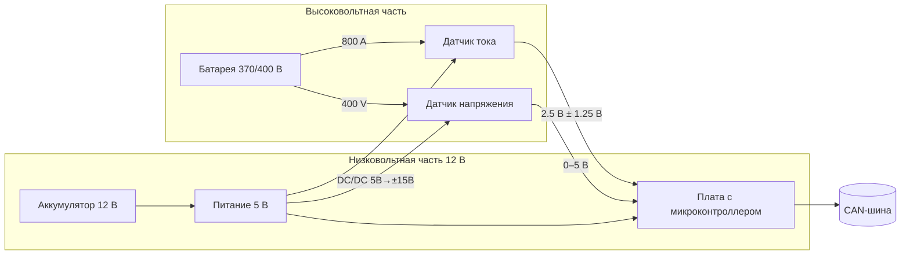

Оба датчика имеют гальваническую развязку (эффект Холла), поэтому
высоковольтная и низковольтная части гальванически развязаны.

---

## Этап 1. Подбор компонентной базы

Критерии выбора: доступность (в наличии в РФ), точность, соответствие
автомобильным условиям, пригодность к серийному выпуску.

| Компонент | Назначение | Обоснование | Ссылка | Аналоги |
|---|---|---|---|---|
| LEM HTFS 800-P/SP2 (~5000 ₽ от 50 шт) | Датчик тока | Номинал 800 А (диапазон до 1200 А), погрешность 1 %, гальваническая развязка, питание 5 В. Выход по даташиту: Vout = Vref ± (1.25 В × I/IPN), Vref = VCC/2 — т.е. ноль 2.5 В, ±800 А → 1.25–3.75 В. | [ChipDip](https://www.chipdip.ru/product/htfs-800-p-sp2-lem-series-current-transformer-1200a-8070176057) | CSHV800A-001, датчики Acrel, аналоги с Alibaba (даташиты на китайском, требуют верификации) |
| CYHVS400T (~12000 ₽ от 8 шт) | Датчик напряжения | До 400 В, погрешность 1 %, гальваническая развязка, выход 0–5 В, питание ±15 В | [ChipDip](https://www.chipdip.ru/product/cyhvs400t-datchik-napryazheniya-400vac-15vdc-5v-dc-chenyang-8014215035) | Резистивный делитель напряжения + оптопара или изолированный усилитель (например, AMC1301) — за копейки, но требует калибровки и самостоятельной оценки точности |
| ATtiny85 (~350 ₽ от 50 шт) | Микроконтроллер | Дёшев, 8 КБ флеша достаточно (код занимает ~2.5 КБ), легко разводится, питание 5 В напрямую совместимо с выходами датчиков. Запас по функционалу не нужен — задача фиксированная | [ChipDip](https://www.chipdip.ru/product/attiny85-20pu-microchip-8342917286) | ATtiny45 (4 КБ флеша — впритык); при нехватке пинов — esp32 или LGT8F328P |
| Модуль MCP2515 + TJA1050 (~1000 ₽) | CAN-интерфейс | У ATtiny85 нет CAN-периферии; MCP2515 берёт на себя весь протокол. | [ChipDip](https://www.chipdip.ru/product/mcp2515-can-kontroller-s-spi-interfeysom-modul-skb-element-8013336627) |  МК со встроенным CAN (ESP32 TWAI) |
| TLE42744DV50ATMA1 (~225 ₽ от 50 шт) | DC/DC 12 В → 5 В | Популярный втомобильный преобразователь, вход до 40 В, (выход 400мА max) | [ChipDip](https://www.chipdip.ru/product/tle42744dv50atma1-fixed-ldo-voltage-regulator-5.5v-infineon-8110162539) | полно аналогов |
| TMA 0515D (~600 ₽ от 100 шт) | DC/DC 5 В → ±15 В | Питание для датчика напряжения CYHVS400T | [ChipDip](https://www.chipdip.ru/product/tma-0515d-dc-dc-preobrazovatel-1vt-vhod-4.5-5.5v-traco-9000012539) | много аналогов |
| MBR160HW (~50 ₽ от 10 шт) | Диод Шоттки, защита от переполюсовки | В электромобиле нет больших просадок напряжения, поэтому можно использовать диод | [ChipDip](https://www.chipdip.ru/product/mbr160hw-sangdest-8001952881) | полно аналогов |
| P4SMAJ18A (~20 ₽ от 100 шт) | TVS диод, защита от выбросов бортсети | Рабочее напряжение 18 В: не открывается при штатных 14.4–14.7 В генератора, гасит всплески; | [ChipDip](https://www.chipdip.ru/product/p4smaj18a-diotec-8002431466) | полно аналогов |

Погрешность (цель — 2 %):

| Источник | Вклад в погрешность |
|---|---|
| Датчик тока HTFS 800-P/SP2 | ±1 % (при 25 °C) |
| Датчик напряжения CYHVS400T | ±1 % (при 25 °C) |
| АЦП ATtiny85 (10 бит) | ±0.4 % |
| Погрешность питания | **в теории исключена**: датчики ратиометрические — дрейф питания одинаково сдвигает опору и сигнал |
| **Итого (сумма)** | **≈ 1.5 %** — укладываемся в 2 % |

Запас 0.5 % оставлен на температурный дрейф; при необходимости в ПО
закладывается температурная компенсация калибровочной таблицей
(см. «Перспективы»). Точность необходимо подтверждать стендовыми испытаниями.

### Бюджет питания (LDO 400 мА)

| Потребитель | Ток | Примечание |
|---|---|---|
| ATtiny85 | ≈ 10 мА | |
| HTFS 800-P/SP2 | ≈ 25 мА | |
| Модуль MCP2515 + TJA1050 | ≈ 5 мА |  |
| TMA 0515D | до 260 мА | выдаёт 35 мА; нагрузка — CYHVS400T ≈ 25 мА |
| **Итого** | **≈ 300 мА** | запас до предела (400 мА) — 25 % |

---

## Этап 2. Электрическая схема

Схема разработана в KiCad 10 (самый простой рабочий вариант):

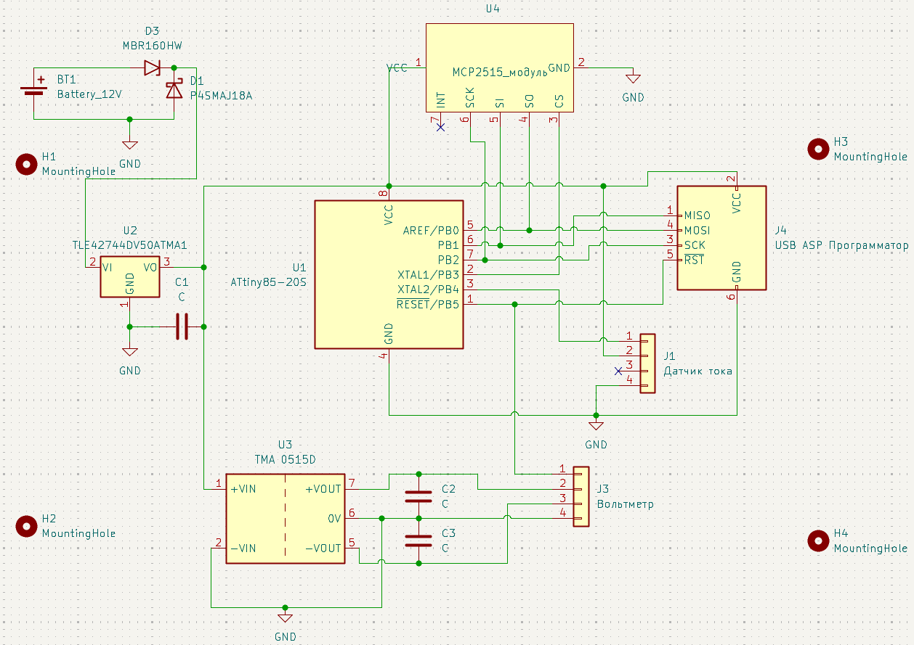

## Этап 3. Печатная плата

Макет разработан в KiCad 10.

### Разводка (слои)

ВАЖНОЕ ПРИМЕЧАНИЕ: элементы я расположил по принципу легкой разводки,
в реальности надо знать место крепления в авто и уже от этого опираться

| Верхний слой | Нижний слой |
|:---:|:---:|
| 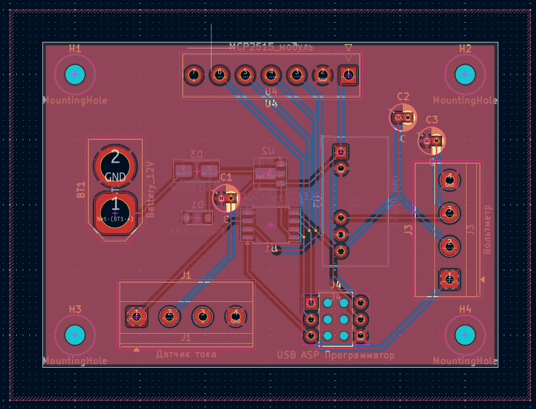 | 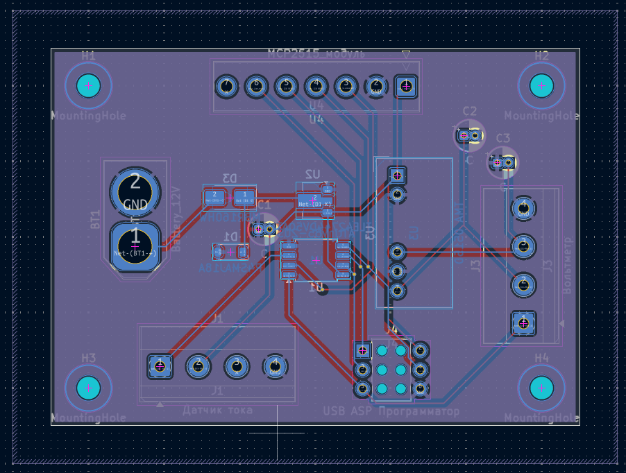 |

### 3D-модель платы (рендер KiCad)

> На рендере некоторые 3д элементы движок Kicad немного неправильно генерирует

| Вид сверху | Вид снизу |
|:---:|:---:|
| 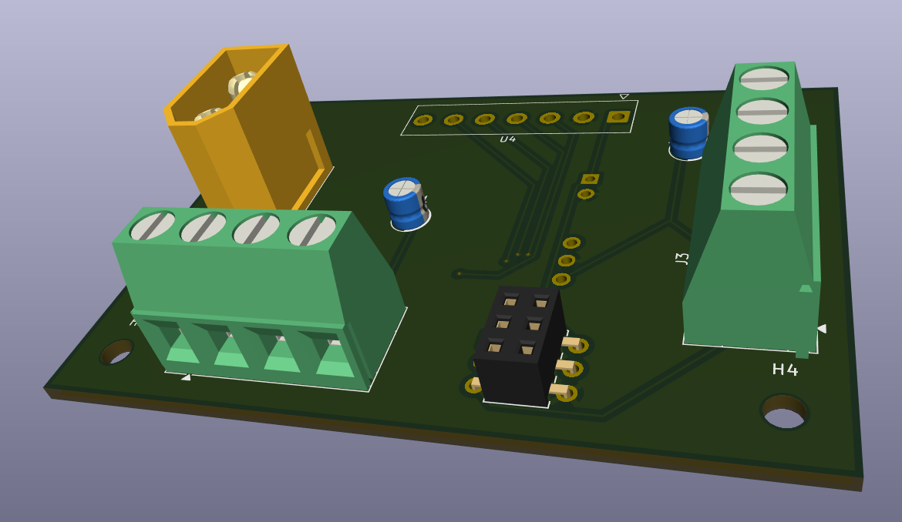 | 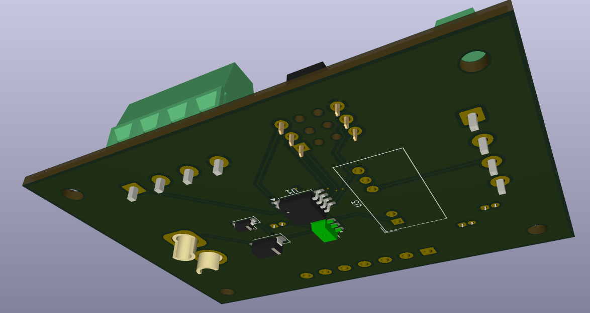 |

### Теплоотвод (модель в FreeCAD)

Нагревающиеся элементы (диоды, DC/DC-преобразователи и микроконтроллер)
специально размещены на **нижней** стороне платы — это позволило
прижать к ним общий радиатор. 3D-модель платы экспортирована из KiCad
в FreeCAD, где спроектирован радиатор:

| | | |
|:---:|:---:|:---:|
| 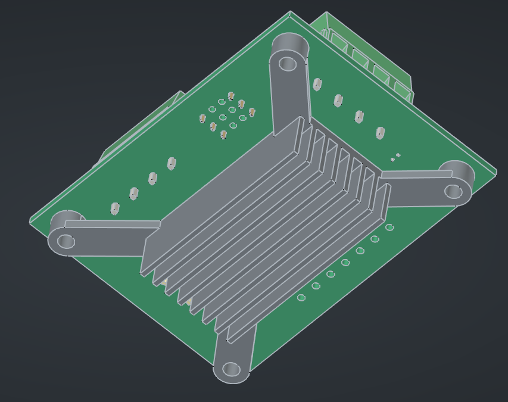 | 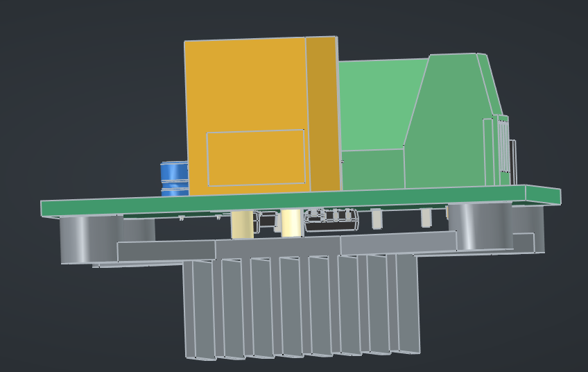 | 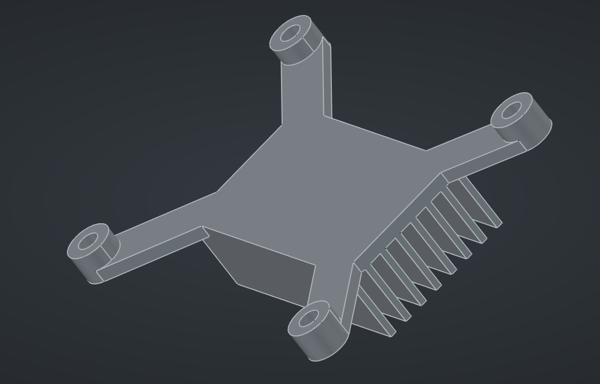 |

> **Исходные файлы** проектов KiCad и FreeCAD в репозиторий не включены:
> для их открытия требуется установленный KiCad 10 / FreeCAD.
> Предоставляю по запросу.

## Этап 4. Программное обеспечение

Код: `auto_av_digispark/` — Arduino-проект для ATtiny85.

| Файл | Назначение |
|---|---|
| `auto_av_digispark.ino` | измерения, калибровка, упаковка фрейма, диагностика, watchdog |
| `mcp2515.h` / `mcp2515.cpp` | минимальный драйвер MCP2515 через USI в трёхпроводном режиме |

> **Почему собственный драйвер, а не готовая библиотека**
> (например, autowp/arduino-mcp2515): у ATtiny85 нет выделенного
> SPI-контроллера, как у ATmega (регистров `SPCR`/`SPSR`/`SPDR` не
> существует) — вместо него есть USI, который аппаратно поддерживает
> трёхпроводный SPI-совместимый режим на пинах P0 (DI), P1 (DO),
> P2 (USCK). Готовые библиотеки написаны под регистры ATmega и на этом
> МК не компилируются (проверено: autowp/arduino-mcp2515 v1.3.1 + ядро
> digistump 1.6.7 — ошибки по отсутствующим регистрам `SPCR`, `SPDR`).
> Кроме того, из всей функциональности библиотеки по ТЗ нужна только
> передача, а приём, фильтры и прерывания остались бы мёртвым кодом.
> При миграции на МК с аппаратным SPI (ATmega328P, ESP32) целесообразно
> перейти на autowp/arduino-mcp2515.

### Карта пинов ATtiny85

МК — ведущий (master) на шине SPI, MCP2515 — ведомый.

| Пин | Функция | Направление | Куда идёт |
|---|---|---|---|
| P0 | вход данных | вход | ← SO модуля MCP2515 |
| P1 | выход данных | выход | → SI модуля MCP2515 |
| P2 | тактирование  | выход | → SCK модуля MCP2515 |
| P3 | выбор чипа | выход | → CS модуля MCP2515 (внешняя подтяжка 10 кОм к +5 В) |
| P4 | ADC2 — аналоговый вход | вход | ← выход датчика тока (0-5 В) |
| P5 | ADC0 — аналоговый вход | вход | ← выход датчика напряжения (2.5-5 В; см. ограничения ниже) |

> Примечание: в даташите ATtiny85 пины подписаны P0 = `MOSI/DI`,
> P1 = `MISO/DO` — эти названия относятся к режиму ISP-программирования,
> где МК является ведомым. В нашем устройстве МК — ведущий, поэтому
> роли зеркальны: выход данных USI (P1) = MOSI, вход (P0) = MISO.

### Формат CAN-фрейма (ID 0x293, 8 байт)

| Байты | Поле | Формат |
|---|---|---|
| 0–1 | Ток | int16, 0.1 А/бит |
| 2–3 | Напряжение | uint16, 0.1 В/бит |
| 4–5 | Мощность | int16, 10 Вт/бит (максимум 800 А × 400 В = 320 кВт) |
| 6 | Состояние | битовое поле, см. ниже "Байт состояния" |
| 7 | Счётчик + CRC | старший полубайт — счётчик 0–15, младший — контрольная сумма по байтам 0–6 и счётчику |

Байт состояния:

| Бит | Значение |
|---|---|
| 0x01 | CAN_OK — MCP2515 инициализирован |
| 0x02 | CALIBRATED — калибровка нуля тока завершена |
| 0x04 | ERR_SENSOR — показания АЦП вне диапазона (обрыв/КЗ датчика) |
| 0x08 | ERR_CAN — фрейм не отправлен |
| 0x10 | CAL_FALLBACK — ноль тока принят теоретическим 2.5 В: при калибровке линия была под током (перезагрузка «на ходу») |
| 0x80 | HEARTBEAT — инвертируется каждый цикл («живой» МК) |

Диагностика построена слоями — каждый механизм ловит свой класс отказов:

| Механизм | Класс отказа | Как видит приёмник |
|---|---|---|
| Счётчик (0–15) | Потеря сообщений в шине | пропуск в последовательности |
| CRC-4 | Искажение битов при передаче | несовпадение контрольной суммы |
| HEARTBEAT | Зависание главного цикла при «живом» CAN | бит перестал чередоваться (5 Гц), хотя сообщения приходят |
| Watchdog (1 с) | Полное зависание МК | пауза в сообщениях, затем рестарт с перекалибровкой; если линия под током — флаг CAL_FALLBACK |

HEARTBEAT инвертируется на каждом цикле независимо от измеренных
значений и от успеха отправки: по нему приёмник отличает «данные не
меняются, потому что автомобиль припаркован» от «данные замерли, потому
что зависла прошивка». Полное зависание ловится таймаутом
сообщений и сбросом по watchdog — история флагов в байте состояния
показывает, что происходило с устройством.

### Логика работы

1. **Период 100 мс** задаётся планировщиком на `millis()` с компенсацией
   времени исполнения (`nextSend += 100`) — период не накапливает дрейф.
2. **Калибровка нуля тока** (в `setup()`, до запуска основного цикла):
   5 измерений с интервалом 10 мс, первый отсчёт — через 10 мс после
   старта, когда переходные процессы подачи питания 0→5 В уже затухли.
   Дальше два исхода:
   - среднее близко к теоретическому нулю 2.5 В (допуск ±25 LSB ≈ ±78 А;
     собственный офсет датчика по даташиту ±5 LSB) — линия без тока,
     среднее принимается за офсет датчика, флаг **CALIBRATED**;
   - среднее далеко от 2.5 В — силовая линия под током (например, МК
     перезагрузился по watchdog «на ходу»). Принять измеренное за ноль
     обнулит реальный ток, поэтому используется теоретический ноль 2.5 В
     и передаётся флаг **CAL_FALLBACK** — приёмник видит, что показания
     тока могут содержать нескомпенсированный офсет датчика (±5 LSB ≈ ±16 А).
   **Почему ток калибровать можно, а напряжение — нет**: автокалибровке
   нужен эталон нуля. Для тока он существует в самом автомобиле — в момент
   запуска контакторы разомкнуты и ток гарантированно равен 0 А. Для
   напряжения эталона нет: батарея всегда под 370–400 В, и усреднение
   показаний при старте приняло бы реальные 380 В за «ноль». Поэтому
   напряжение измеряется напрямую по шкале АЦП без вычитания офсета.
3. **Измерение**: 2 выборки АЦП на канал с усреднением (подавление шума),
   пересчёт в физические величины целочисленной арифметикой.
4. **Диагностика**: выход АЦП за границы шкалы → ERR_SENSOR; неуспешная
   отправка → ERR_CAN; зависание > 1 с → аппаратный перезапуск (watchdog);
   при потере MCP2515 — переинициализация каждый цикл.
5. **Счётчик** инкрементируется только при успешной отправке — приёмник
   по пропускам видит потери, по CRC — искажения.

### Сборка и прошивка

через Arduino IDE или arduino-cli (необходимо установить библиотеки)

Результат компиляции: **2762 байт флеша (~34 % от 8 КБ), 19 байт RAM**.

### Известные ограничения демо и допущения

- **Частота кварца модуля MCP2515** — проверить маркировку (обычно 8 МГц)
  и при необходимости установить `MCP2515_CRYSTAL_MHZ 16` в `mcp2515.h`.
- **P5 — пин RESET**: напряжение на нём не должно падать ниже ~VCC/2,
  иначе МК перезагрузится. Датчик напряжения CYHVS400T в теории выдает
  2.5–5 В (полярность батареи не меняется) и условие VCC/2 выполняет.
  Фьюз RSTDISBL не программировать — иначе ISP-прошивка станет
  невозможной. Для серийного устройства рекомендуется МК с большим
  числом свободных входов.
- **Если демо собирается на плате Digispark** (а не на голом ATtiny85):
  на P3/P4 припаяна USB-обвязка (стабилитроны 3.6 В) — сигнал датчика
  тока на P4 выше ~3.6 В будет обрезаться. Максимум выхода датчика
  3.75 В (при +800 А), поэтому теряется лишь верхние ~4 % шкалы.
  В серийной плате ограничения нет.
- Константы датчиков (`CURRENT_NOMINAL_A`/`CURRENT_SPAN_MV` — уже по
  даташиту LEM; `VOLTAGE_FULL_SCALE_V` — для CYHVS400T) перед серией
  уточнить по даташитам и откалибровать на стенде.
- Я не стал указывать номенклатуру конденсаторов (стабилизируют напряжение),
  так ка надо проверять в реальности какие будут лучше работать (через осциллограф)

---

## Этап 5. Рекомендации по применению и перспективы развития

**Размещение и эксплуатация:**

- обязательно экранировать плату и провода
- надо тестировать либо плату дальше от силовых линий (в линиях к датчикам могут возникать помехи), 
  либо ближе - не знаю где будут меньше помехи, надо тестировать
- питание 12 В — желательно через отдельный предохранитель;
- CAN — витой парой к шине автомобиля; **убрать терминатор 120 Ом
  с модуля MCP2515** — шина автомобиля уже терминирована на концах
  (на демо-стенде из двух модулей, наоборот, оставить на обоих).
- в герметичном корпусе;
- рабочая температура ограничена компонентами (плюсом температурный дрейф у датчиков);

**Перспективы развития**

1. **Температурная компенсация** показаний калибровочной таблицей в ПО
   (датчики дают заявленный 1 % только при 25 °C).
2. **Внешний АЦП** (12–16 бит) и МК с большим числом входов — рост
   точности.
3. **Элемента Пельте** можно использовать в качестве стабилизатора температуры

Также предлагаю рассмотреть варианты отказоустойчивой платы (воодушевился системой космолета Буран) (для этого
потребуются микроконтроллеры с большим количеством пином, интересный и дешевый вариант - LGT8F328p):
суть в том, что если один элемент 'умер', то это не повлияет на работоспособность. Если происходит ошибка (данные не
сходятся), то идет переключение на другой источник, а также подается дополнительный сигнал в шину данных об ошибке,
так как если упадет ещё один элемент, то система перестанет работать, поэтому при появлении ошибки надо незамедлительно
заменить элемент. На ум пришли две схемы:
1. с неравными ролями (более проста для понимания)
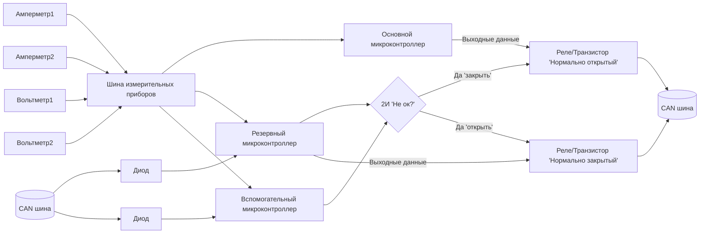

2. с равными ролями (сложнее в реализации, но отказоустойчивее)
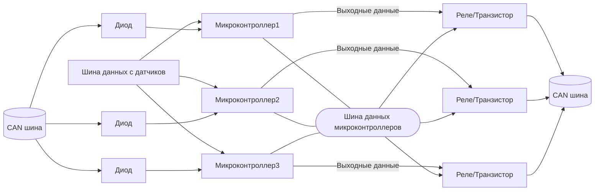
